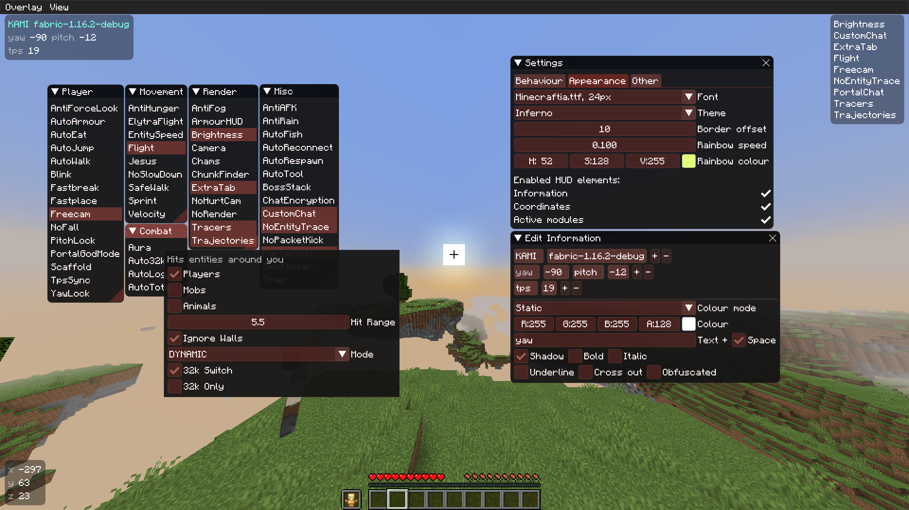

# KAMI

## A Minecraft utility mod for anarchy servers.

The Fabric 1.16.2 version is in active development.

## Preview

 
Click to view images

 

 

## Installing

KAMI is a fabric mod. Download the [latest release](https://github.com/zeroeightysix/KAMI/releases), or preferrably, [**build it yourself**](#building).

Download and run the installer for Fabric from [here](https://fabricmc.net/use/) if you do not have it already. KAMI does not require Fabric API.

Move the KAMI jar file to the `mods` folder in your `.minecraft` directory.

## How do I

##### Open the GUI
Press Y.

##### Use commands
The default prefix is `.`. Commands are used through chat, use `.commands` for a list of commands.

##### Bind modules
Run `.bind <module> <key>`.

##### Change command prefix
By using the command `prefix <prefix>` or after having ran KAMI (make sure it's closed), editing your configuration file (find it using `config path` in-game) and changing the value of `commandPrefix` to change the prefix.

## Troubleshooting
Please reference the main [troubleshooting page](docs/TROUBLESHOOTING.md)

To ask for help, join the [Discord](http://discord.gg/9hvwgeg)

If you experience an issue and it's not listed there, please [open a new issue](../../issues/new/choose) and a contributor will help you further.

## Setting up

### IntelliJ
1. In Intellij, navigate to `File > New > Project from Version Control...`
2. Paste `https://github.com/zeroeightysix/KAMI/` in the `URL` field, and hit **Clone**.
3. Allow gradle to set up the project. This might take a while. *(~ 8 minutes)*

###### Optionally,
* To generate the run configurations, run the `idea` gradle task.
* To generate attachable sources, run the `genSources` task and attach the generated sources in your IDE.

## Building

1. Download or clone the KAMI repository.
2. Run `gradle build`
3. The built jar is in `build/libs/`. There are 4 jars, pick the one **without** a suffix.

## Thank you
[ZeroMemes](https://github.com/ZeroMemes) for [Alpine](https://github.com/ZeroMemes/Alpine)

[ronmamo](https://github.com/ronmamo/) for [Reflections](https://github.com/ronmamo/reflections)

The [Minecraft Forge team](https://github.com/MinecraftForge) for [Forge](https://files.minecraftforge.net/)

The [Fabric Team](https://github.com/FabricMC) for [Fabric](https://github.com/FabricMC/fabric-loader) and [Yarn](https://github.com/FabricMC/yarn)
